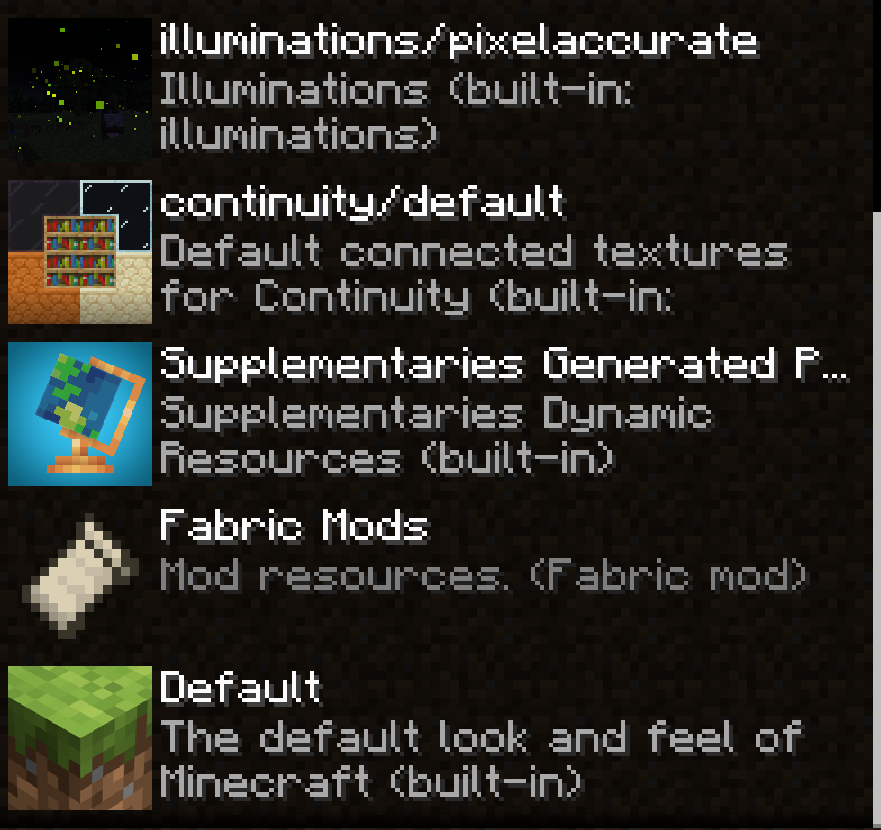

# Please select a branch
- [1.19.2](https://github.com/MaoSpiritLink/gey-minecraft/tree/1.19.2)

# Keybind
To bind the Roll option to a key go to

    Esc -> Options -> Controls -> Keybinds -> Combat Roll -> Roll -> (choose a key)

For example you could choose key *R* but make sure the key is not bound to another option!

# Ressource Packs
To enable Ressource Packs go to

    Esc -> Options -> Ressource Packs

About illuminations: The *illuminations/picelsaccurate* is optional. If you want illuminations with lower resolution (because of performance issues) then choose *illuminations/lowerres* instead.

